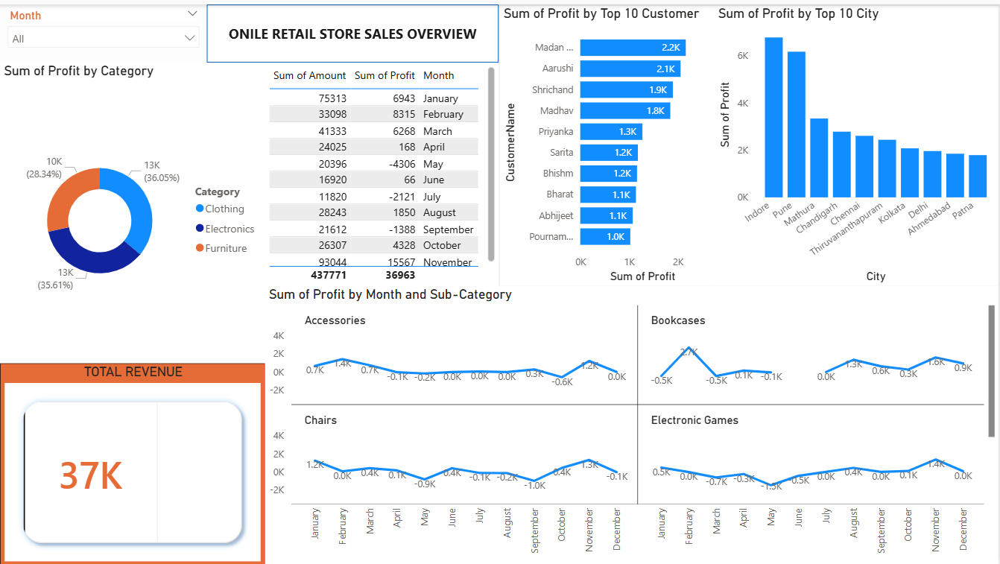

# E-COMMERCE-STORE-SALES-ANALYSIS-USING-EXCEL-AND-POWER-BI
# E-Commerce Sales Analysis Dashboard 📊

## Overview
This project is an interactive Power BI dashboard developed to analyze e-commerce sales performance, customer purchasing behavior, and revenue trends. The dashboard transforms raw sales data into visual insights to support business decision-making and performance tracking.

---

## Objectives
- Analyze overall sales and revenue performance
- Identify top-selling products and categories
- Monitor monthly sales trends
- Compare sales performance across countries/regions
- Understand customer purchasing patterns

---

## Dashboard Features
- 📈 Total Revenue KPI
- 🌍 Revenue by Country/Region
- 📅 Monthly Sales Trends
- ⭐ Top-Selling Products
- 🔍 Interactive Filters and Slicers

---

## Tools Used
- Power BI
- Power Query
- Excel

---

## Skills Demonstrated
- Data Cleaning and Transformation
- Data Visualization
- Sales Trend Analysis
- Dashboard Design
- Business Insight Reporting

---

## Dashboard Preview

---
## Key Insights
- Identified top-performing countries contributing the highest revenue
- Analyzed seasonal trends in customer orders
- Highlighted best-selling products and sales distribution patterns
- Improved visibility into sales performance through interactive reporting

---

## Project Files
- `Ecommerce_Sales_Dashboard.pbix`
- `dashboard-screenshot.png`
- `README.md`

---

